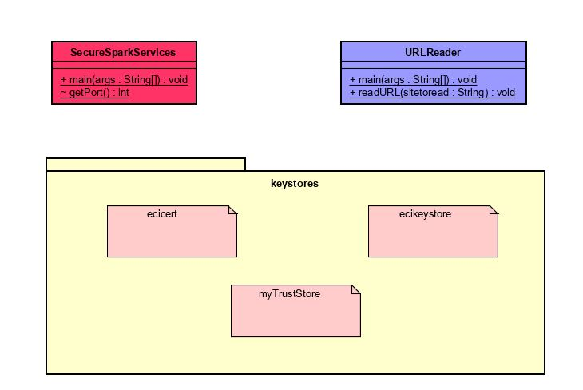

# HOMEWORK 5 AREP (Aplicación distribuida segura en todos sus frentes)


For the task you must build an application with the proposed architecture and deploy it on AWS using EC2 and Docker.

* It must allow secure access from the browser to the application. In other words, it must guarantee user authentication, authorization and integrity.
* It must have at least two computers communicating with each other and remote services access must guarantee: authentication, authorization and integrity between the services. No one can invoke the services if they are not authorized.
* Explain how you would scale your security architecture to incorporate new services.

# DESIGN



# STEP BY STEP

* Create non-secure web application.
* Create a key pair and generate the certificates.
* Adapt the application to use these generated certificates.

# DELIVERABLES

* Code on github.
* Security architecture of your prototype.
* Experiment video on AWS.

# START

Copy the project through git clone in any direction to start working:
```
git clone https://github.com/Juaco9502/Aplicaci-n-distribuida-segura---AREP.git
```

## PRE-REQUISITES

* Java jdk > 7
* Maven (Apache Maven)
* Git

## INSTALL

1. Run in terminal:

```
java -cp target/classes;target/dependency/* edu.eci.arep.SparkWebApp
```

2.(Optional):
If you want to view the documentation of the application, execute the following command and check the following path: root / target / site / apidocs:

```
mvn javadoc:javadoc
```

3.If you want to use the web application, go to your preferred browser (Mozilla Firefox, Google Chrome, Internet Explorer, Opera, etc.) and enter the following address:

```
localhost:4567/inputdata
```

## BUILT

* [Maven](https://maven.apache.org/) - Dependency Management
* [JAVA JDK 8](http://www.oracle.com/technetwork/java/javase/overview/index.html) - Building
* [Docker](https://www.docker.com/)
* [Amazon Web Services](https://aws.amazon.com/es/education/awseducate/) - Amazon Educate
* [Spark Framework](http://sparkjava.com/)


## AUTHOR

* **JUAN CAMILO ORTIZ MEDINA** - [Juaco9502](https://github.com/juaco9502)


## LICENSE

This project is licensed under the GNU General Public License - [LICENSE](LICENSE) 